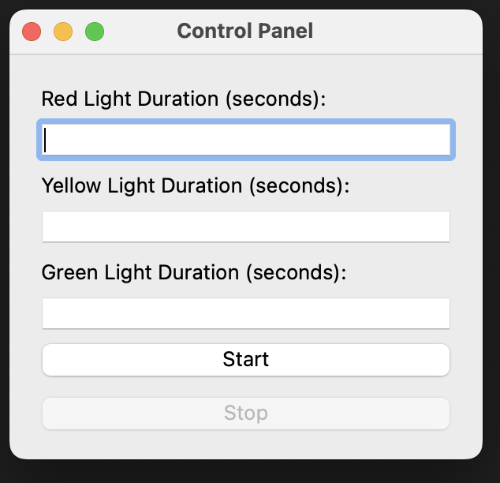
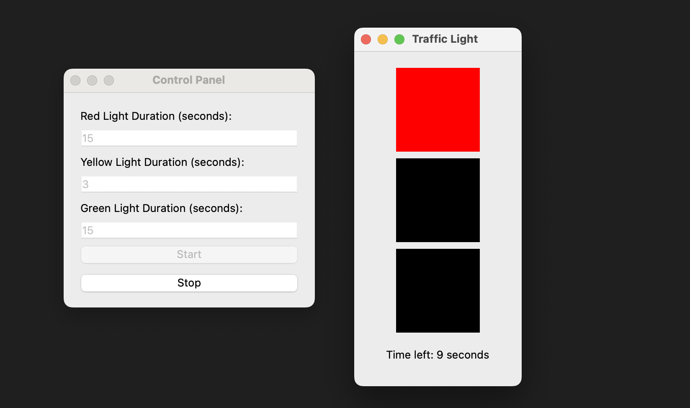
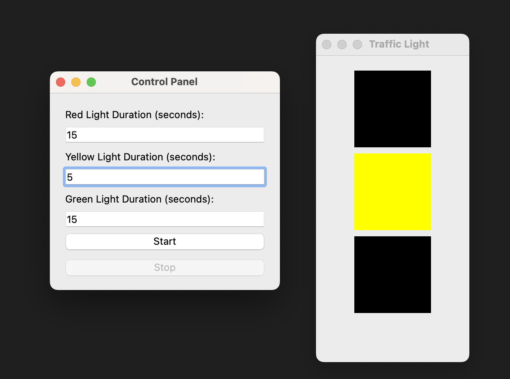

How to Run the Code
---
- run traffic_light_simulation.py 

more details
---
- then,you will see the control panel interface 

- give valid input and press 'start', the traffic light display interface appears

- you can press 'stop' button to modify durations for the three lights.

